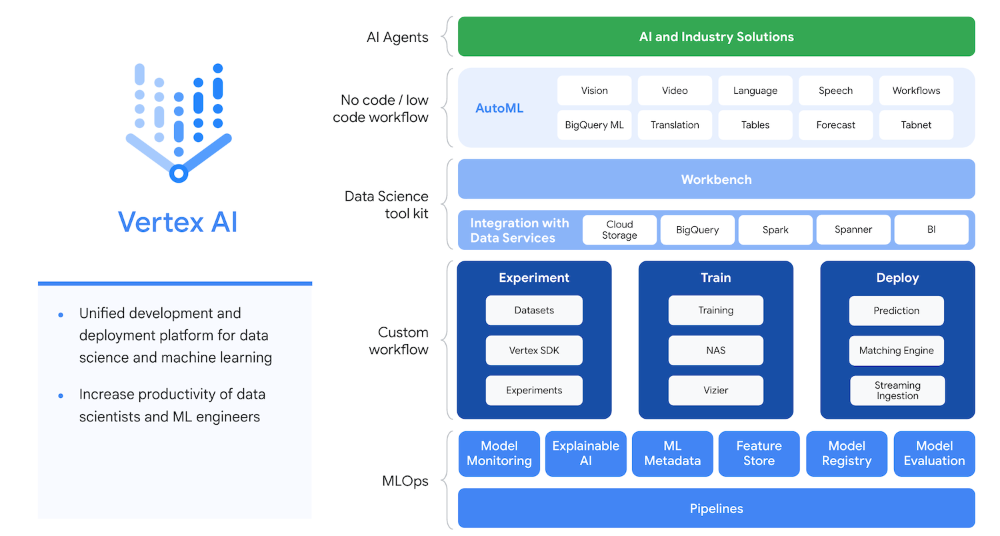

# Vertex AI

Vertex AI brings AutoML and AI Platform together into a unified API, client library, and user interface. AutoML lets you train models on image, tabular, text, and video datasets without writing code, while training in AI Platform lets you run custom training code. With Vertex AI, both AutoML training and custom training are available options. Whichever option you choose for training, you can save models, deploy models, and request predictions with Vertex AI.

### Model training
You can train models on Vertex AI by using AutoML, or if you need the wider range of customization options available in AI Platform Training, use custom training.

In custom training, you can select from among many different machine types to power your training jobs, enable distributed training, use hyperparameter tuning, and accelerate with GPUs.

### Model deployment for prediction
You can deploy models on Vertex AI and get an endpoint to serve predictions on Vertex AI whether or not the model was trained on Vertex AI.

### Data Labeling
Data Labeling jobs let you request human labeling for a dataset that you plan to use to train a custom machine learning model. You can submit a request to label your video, image, or text data.

To submit a labeling request, you provide a representative sample of labeled data, specify all the possible labels for your dataset, and provide some instructions for how to apply those labels. The human labelers follow your instructions, and when the labeling request is complete, you get your annotated dataset that you can use to train a machine learning model.

### Feature Store
Vertex AI Feature Store is a fully managed repository where you can ingest, serve, and share ML feature values within your organization. Vertex AI Feature Store manages all the underlying infrastructure. For example, it provides storage and compute resources for you and can easily scale as needed.

### Explainable AI 
Vertex Explainable AI helps you understand your model's outputs for classification and regression tasks. Vertex AI tells you how much each feature in the data contributed to the predicted result. You can then use this information to verify that the model is behaving as expected, recognize bias in your models, and get ideas for ways to improve your model and your training data.

### Vizier 
Vertex AI Vizier is a black-box optimization service that helps you tune hyperparameters in complex machine learning (ML) models. When ML models have many different hyperparameters, it can be difficult and time consuming to tune them manually. Vertex AI Vizier optimizes your model's output by tuning the hyperparameters for you.

### Endpoints 
Using private endpoints to serve online predictions with Vertex AI provides a low-latency, secure connection to the Vertex AI online prediction service. This guide shows how to configure private endpoints on Vertex AI by using VPC Network Peering to peer your network with the Vertex AI online prediction service.

### Experiments 
The goal when developing a model for a problem is to identify the best model for that particular use case. To this end, Vertex AI Experiments enables you to track, analyze, compare, and search across different ML Frameworks (for example, TensorFlow, PyTorch, scikit-learn) and training environments.

### ML Metadata 
Vertex ML Metadata lets you record the metadata and artifacts produced by your ML system and query that metadata to help analyze, debug, and audit the performance of your ML system or the artifacts that it produces.

### Model Evaluations

### Model Registry

--------------------------------------------------------------------------------

_Let's connect and chat! Open to anyone on Earth under the Sun and Moon._
Find all my social links here

#### All My Links
[BioLink](https://bio.link/paulkamau)

#### Buy Me Coffee
[Cashapp](https://bio.link/paulkamau)
[PayPal](https://paypal.me/paulkamau)